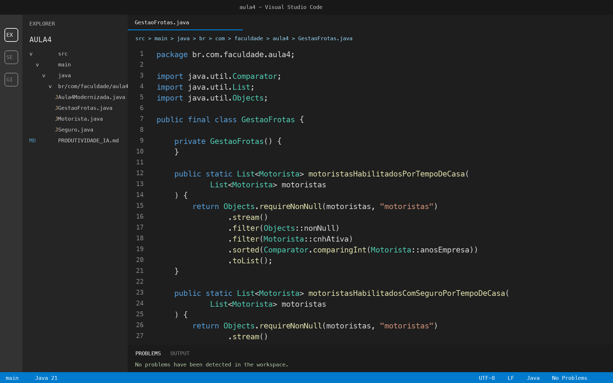

# PRODUTIVIDADE IA - Aula 4

## 1. Codigo modernizado

Trecho final em Java 21, modernizando o codigo legado que usava `for-each` e `Comparator` anonimo:

```java
List<Motorista> habilitados = motoristas.stream()
        .filter(Motorista::cnhAtiva)
        .sorted(Comparator.comparingInt(Motorista::anosEmpresa))
        .toList();

habilitados.stream()
        .map(Motorista::resumo)
        .forEach(System.out::println);
```

Versao com o desafio do `Optional` de seguro ativo:

```java
List<Motorista> habilitadosComSeguro = motoristas.stream()
        .filter(Motorista::cnhAtiva)
        .filter(Motorista::possuiSeguroAtivo)
        .sorted(Comparator.comparingInt(Motorista::anosEmpresa))
        .toList();
```

Arquivo principal criado para validacao: `src/main/java/br/com/faculdade/aula4/Aula4Modernizada.java`.

## 2. Relato do aprendizado

O insight mais importante foi perceber que a Stream API nao serve apenas para "escrever menos codigo", mas para declarar melhor a intencao do programa. No codigo antigo, eu precisava ler os detalhes do loop, da lista temporaria e do `Comparator` anonimo para entender o objetivo. Na versao moderna, a sequencia `filter`, `sorted`, `map` e `forEach` mostra o fluxo de dados quase como uma frase. Isso melhora a manutencao porque outra pessoa consegue entender rapidamente o que entra, o que e filtrado, como e ordenado e qual e a saida.

## 3. Prompt do tradutor de eras

```text
Atue como um engenheiro de software senior especializado em Java. Tenho um codigo legado que usa Java 7 (for-each e Comparator anonimo) e preciso moderniza-lo para Java 21, utilizando Stream API e Method References.

Reescreva o codigo, explique cada mudanca realizada e por que a nova versao e mais segura e mais facil de manter.
```

## 4. Prompt de desafio socratico

```text
Agora, explique-me: se eu quisesse que esse filtro tambem removesse motoristas que nao possuem um Optional de seguro ativo, como eu alteraria essa Stream? Nao me de o codigo, explique-me a logica.
```

## 5. Entendimento da logica do desafio

Eu manteria o mesmo fluxo da Stream, mas adicionaria um segundo filtro depois do filtro de CNH ativa. Esse novo filtro verificaria se o `Optional` do seguro contem um valor e se esse seguro esta ativo. Assim, a lista final so manteria motoristas que passam pelas duas regras de negocio: estao habilitados e possuem seguro ativo. Depois disso, a ordenacao por tempo de casa continua igual, porque ela e uma etapa independente do filtro.

## 6. Captura de tela



## 7. Validacao

O projeto foi estruturado para Java 21 usando `record`, `Optional`, Stream API, `Comparator.comparingInt`, method references e `toList()`. Para validar no VS Code com JDK 21 instalado, compile e execute a classe `Aula4Modernizada`.
